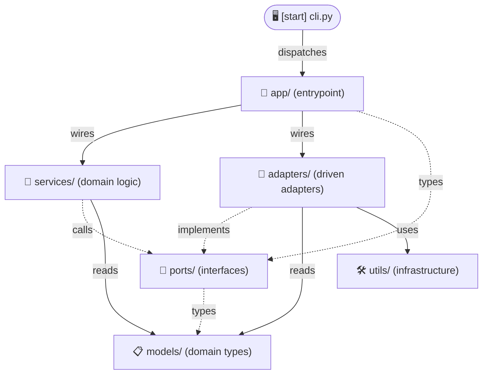
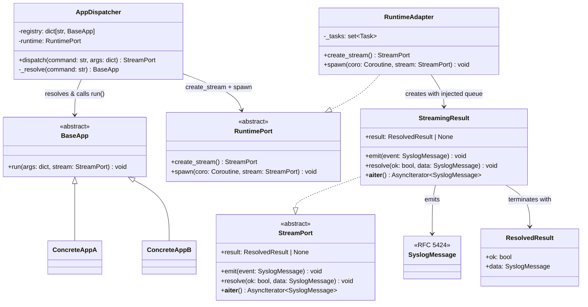
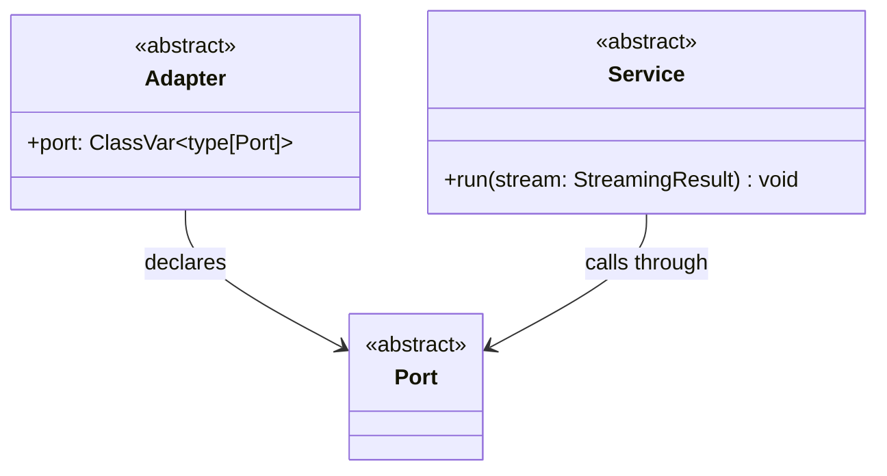

# Architecture

The goal is to focus on best-practice recommendations that genuinely reduce decision-making. The strongest moves are those that remove the most entropy per unit of added complexity.

> **Meta-rule:** every rule in this document must be machine-enforceable. Rules that cannot yet be enforced mechanically are marked *(deferred)* and excluded from the toolchain until a concrete gate can be defined.

## Standards

Source's I/O layer implements **SCOP (Structured CLI Output Protocol) v0.1.0-draft** — an open specification for structured CLI output that is simultaneously human-readable as plain text and automatically translatable to GUI. See `SCOP.md`.

| Document | Implements |
| --- | --- |
| Wire Format (this doc) | SCOP §5 |
| Event vocabulary (`SCOP.md` §7) | SCOP §7 |
| CLI Contract (`CLI_CONTRACT.md`) | SCOP §§6, 8, 9 |

## Dependency Diagram

This is the import-dependency contract.



**Edge contract** — each verb names the only permitted coupling for that edge:

| Verb | Permits | Forbids | Enforced by |
| --- | --- | --- | --- |
| `dispatches` | import `AppDispatcher` only | reaching past it into `app/` | import-linter |
| `wires` | construct concrete classes | calling their methods directly | *(deferred)* |
| `implements` | subclass / realize a port | constructing or calling another adapter | ast-grep |
| `calls` | invoke port methods | constructing the implementation | import-linter |
| `reads` | import and read data types | mutating or adding behaviour | ruff + ty (frozen models) |
| `types` | reference for annotations only | runtime use | ruff `FA` + `TID251` |
| `uses` | call pure functions | anything stateful | *(deferred)* |

Dotted arrows (`-.->`) cross an abstraction boundary; solid arrows cross a concrete one.

1. **cli.py** parses `argv` and calls into `app/`
2. **app/** wires the graph — injecting concrete adapters into services via ports
3. **services/** run domain logic, calling out through **ports/** interfaces
4. **adapters/** answer those port calls, using **models/** and **utils/** to do so
5. **adapters/** return a port interface back to the service
6. **services/** emit events and resolve the `StreamingResult`
7. **app/** returns the resolved `StreamingResult` to **cli.py** to render

> `cli.py` may only import `AppDispatcher`.
> `argparse` may only appear in `cli.py`.
> `asyncio` may only appear in `cli.py` and `adapters/runtime_adapter.py` — the event loop and task scheduling are owned at the entry point and the runtime adapter respectively. `app/` returns a `StreamPort` directly; no tuple, no coroutine leaks past the adapter boundary.

## Toolchain

| Tool | Role | Config |
| --- | --- | --- |
| `import-linter` | Import layer contract | `.importlinter` |
| `ast-grep` | Structural + pattern rules | `sgconfig.yml`, `rules/*.yml` |
| `ruff` | Linting + formatting | `pyproject.toml` |
| `ty` | Type checking | `pyproject.toml` |

All four compose under a single `pre-commit` hook.

**Ruff rule selection:**

```toml
[tool.ruff.lint]
select = [
    "ANN",  # type annotations
    "RUF",  # ruff-specific
    "T",    # ban print
    "E",    # pycodestyle errors
    "F",    # pyflakes
    "W",    # pycodestyle warnings
    "I",    # isort
    "N",    # pep8-naming
    "A",    # shadowed builtins
    "B",    # bugbear
    "S",    # security
    "UP",   # modern Python syntax
    "FURB", # idiomatic Python patterns
    "SIM",  # simplify conditions and code
    "RET",  # consistent returns
    "PTH",  # pathlib over os.path
    "ERA",  # no commented-out code
    "PGH",  # no bare type: ignore
    "C4",   # comprehension style
    "PIE",  # unnecessary patterns
    "TID",  # banned-api + import rules
    "PERF", # performance anti-patterns
    "ISC",  # implicit string concatenation
    "ARG",  # unused arguments
    "FA",   # require from __future__ import annotations
    "DTZ",  # datetime timezone awareness
    # D     (docstrings)     — high noise on new projects; add when stable
    # FBT   (boolean trap)   — add without FBT003 when API surface is settled
    # EM    (exception messages) — prescriptive; low entropy gain
    # PL    (pylint full set) — too broad; conflicts with existing rules
    # TCH   (TYPE_CHECKING)  — deliberately omitted; TYPE_CHECKING is banned (Rule 12)
]

[tool.ruff.lint.per-file-ignores]
"tests/*" = ["S101", "ARG"]

[tool.ruff.lint.flake8-tidy-imports.banned-api]
"typing.TYPE_CHECKING".msg = "Import directly — use 'from __future__ import annotations' for forward references (Rule 12)"
```

> **Consider also:** [Vulture](https://github.com/jendrikseipp/vulture) for dead code detection, [Lizard](https://github.com/terryyin/lizard) for cyclomatic complexity, [jscpd](https://github.com/kucherenko/jscpd) for copy-paste detection, [Prettier](https://prettier.io) for non-Python file formatting (YAML, JSON, Markdown, HTML), and [`.editorconfig`](https://editorconfig.org) as the editor-agnostic baseline for indentation and line endings that all other formatters build on. None are required but all complement the toolchain on long-lived projects.

## Conventions

| # | Rule | Enforced by |
| --- | --- | --- |
| 1 | **Two-tier infrastructure** — `utils/` (mechanism) and `adapters/` (policy) may touch the outside world; `models/`, `ports/`, `services/`, and `app/` are stdlib-pure and side-effect-free | ast-grep |
| 2 | **Import layer contract** — dependency graph defines the only permitted import paths | import-linter |
| 3 | **One class per file, name = role** — `*_adapter.py` → `FooAdapter(Adapter)`, same for service/port/app | ast-grep |
| 4 | **Port↔adapter parity** — every adapter implements the port of the same filename | ast-grep |
| 5 | **Marker base per layer** — `Port`, `Adapter`, `Service`, `BaseApp` | ast-grep |
| 6 | **`models/` immutable value types only** — every class must be a `@dataclass(frozen=True)` or an `Enum` subclass; no mutable state; no methods beyond protocol dunders | ruff + ty (frozen dataclasses), ast-grep (Enum subclasses + reject all other class shapes) |
| 7 | **`cli.py` may only import `AppDispatcher`** — `cli.py` is excluded from the import-linter pipeline as an outside consumer; boundary enforced at symbol level only | ast-grep |
| 8 | **`argparse` and `sys.exit` only in `cli.py`** | ast-grep |
| 9 | **MSGID from fixed table only** | ast-grep |
| 10 | **`utils/` module allowlist** — each permitted name MAY exist as either `name.py` or `name/`; no other modules or packages at the `utils/` root are permitted | ast-grep |
| 11 | **Depth import rule** — a file may only import from deeper modules; never from a neighbour or anything closer to root. `app/dispatcher.py` resolves this by placing concrete apps one level deeper under `app/registry/` | ast-grep |
| 12 | **`TYPE_CHECKING` banned** — all imports must work at runtime; use `from __future__ import annotations` for forward references. Guards hide circular-import violations that should be fixed structurally. | ruff `TID251` banned-api + `FA` |

## Import Allowlist

The standard library is universally permitted in every layer without restriction. Third-party imports are narrowly scoped — anything not listed below is forbidden.

`adapters/` is the only layer with an open third-party allowlist; its permitted imports are determined by the port contract it fulfils, not by a global list.

### Layer allowlist

| Layer | Permitted third-party | Note |
| --- | --- | --- |
| `models/` | `pydantic` | `BaseModel` with `frozen=True` satisfies Rule 6 alongside `@dataclass(frozen=True)` |
| `ports/` | none | stdlib `abc` + `typing` only |
| `services/` | none | stdlib only |
| `app/` | none | stdlib only |
| `adapters/` | port-scoped | whatever the implemented port requires |

### `utils/` submodule allowlist

`utils/` is the **mechanism layer** — thin, stateless wrappers over the OS and stdlib with no domain meaning and no port implementations. Only `adapters/` may import from `utils/`. Each permitted name MAY exist as either `name.py` or `name/`; no other modules or packages at the `utils/` root are permitted. **Bold** imports are third-party.

| Name | What it holds | Hard boundary | Imports |
| --- | --- | --- | --- |
| `fs` | Read, write, copy, move, delete, mkdir, glob, stat | Single-file and directory ops only — not archives | `pathlib`, `shutil`, `os`, `glob` |
| `proc` | Spawn, capture stdout/stderr, pipe, timeout, kill | External processes only — not internal concurrency | `subprocess`, `shutil`, `os` |
| `net` | HTTP requests, download, socket connect, DNS | Network I/O only — not serializing the payload | `urllib`, `http`, `socket`, **`httpx`** |
| `fmt` | Encode/decode structured formats — JSON, TOML, YAML, CSV, base64 | Structured data only — not free-form string manipulation | `json`, `csv`, `base64`, `tomllib`, **`pyyaml`**, **`tomli`** |
| `text` | Regex, templates, truncate, wrap, diff, split, normalize | Unstructured strings only — not structured formats | `re`, `textwrap`, `difflib`, `unicodedata` |
| `code` | Python AST parsing, inspection, transformation | Python source analysis only — not general text or serialisation | `ast`, `inspect`, `dis`, `tokenize` |
| `env` | Env vars, platform/OS detection, Python interpreter path, cwd | Runtime context only — not logging or timing | `os`, `sys`, `platform` |
| `time` | Timestamps, durations, date formatting, monotonic clock | Temporal values only — not blocking waits (→ `concurrent`) or scheduling | `datetime`, `time`, `zoneinfo` |
| `hash` | MD5/SHA checksums, content fingerprinting | Integrity primitives only — not keyed operations (HMAC → `crypto`) | `hashlib`, `hmac` |
| `crypto` | Encrypt/decrypt, key derivation, HMAC, secure random tokens | Secrets only — not plain checksums | `secrets`, **`cryptography`** |
| `archive` | Zip/tar/gzip pack and unpack | Compressed bundles only — not plain file copies | `zipfile`, `tarfile`, `gzip`, `bz2`, `lzma` |
| `concurrent` | Thread pool, async helpers, locks, queues, semaphores, sleep | Internal threads/tasks only — not external processes | `asyncio`, `threading`, `concurrent.futures`, `queue` |
| `collect` | Merge dicts, chunk lists, group-by, flatten, deduplicate | In-memory data structure ops only — not I/O | `itertools`, `functools`, `collections` |

**Enforcement pattern:** ban the package globally via `TID251`, then carve out the one permitted submodule with `per-file-ignores`:

```toml
[tool.ruff.lint.flake8-tidy-imports.banned-api]
"httpx".msg       = "HTTP belongs in utils/net/ only"
"pyyaml".msg      = "YAML serialisation belongs in utils/fmt/ only"
"tomli".msg       = "TOML parsing belongs in utils/fmt/ only"
"cryptography".msg = "Encryption belongs in utils/crypto/ only"
"pydantic".msg    = "Pydantic models belong in models/ only"

[tool.ruff.lint.per-file-ignores]
"*/utils/net/*"    = ["TID251"]
"*/utils/fmt/*"    = ["TID251"]
"*/utils/crypto/*" = ["TID251"]
"*/models/*"       = ["TID251"]
"tests/*"          = ["S101", "ARG"]
```

## AppDispatcher

`AppDispatcher` lives in `app/dispatcher.py`. Concrete apps live one level deeper under `app/registry/`, satisfying the depth import rule — `dispatcher.py` imports downward into `registry/`, never across siblings.

`AppDispatcher` never imports `StreamingResult` directly — it only knows `StreamPort`. The concrete stream (with its injected queue) is created by `RuntimeAdapter` via `RuntimePort.create_stream()`. `asyncio` is therefore confined entirely to `adapters/runtime_adapter.py` and `cli.py`.

```text
app/
├── dispatcher.py
├── stream.py
└── registry/
    ├── builder.py
    ├── root_app.py
    └── snap_app.py
```



**How `dispatch()` works:**

```python
def dispatch(self, command: str, args: dict) -> StreamPort:
    app    = self._resolve(command)
    stream = self._runtime.create_stream()          # RuntimeAdapter injects asyncio.Queue
    self._runtime.spawn(app.run(args, stream), stream)  # RuntimeAdapter calls create_task
    return stream                                   # cli.py receives StreamPort only
```

`RuntimeAdapter` is the only place `asyncio` appears outside `cli.py`. It owns the `_tasks` set and the queue construction — nothing in `app/` imports asyncio.

## Marker Bases



| Base | Lives in | Enforcement hook |
| --- | --- | --- |
| `Port` | `ports/` | Every class in `ports/` must subclass `Port` |
| `Adapter` | `adapters/` | Must declare `port: ClassVar[type[Port]]` — enables parity check |
| `Service` | `services/` | Must implement `run(stream: StreamingResult)` — stream is the result channel |

`Service.run()` returning `void` eliminates a separate result type — output flows through `StreamingResult` events, not return values.

## MSGIDs

Full specification: `SCOP.md` §7. The `PROCESS_*` family is the minimum viable set for any command that runs an operation.

| MSGID | Meaning | Required fields |
| --- | --- | --- |
| `PROCESS_BEGIN` | Start a named operation | `id`, `label` |
| `PROCESS_UPDATE` | Update progress | `id`, `current` |
| `PROCESS_END` | Complete an operation | `id`, `ok` |
| `PROCESS_LOG` | Freeform log line within an operation | `id`, `message` |

The `id` field ties events to a named operation. Nested or parallel operations use distinct `id` values — no new types required.

`ResolvedResult.data` must be a `PAGE_END` message.

> `MSGID` must be one of the values defined in `SCOP.md` §7.

## Wire Format

Implements **SCOP §5**. `SyslogMessage` events are serialised as **NDJSON** — one JSON object per line. The schema is RFC 5424; the serialisation format is NDJSON.

```json
{"pri": 6, "msgid": "PROCESS_BEGIN", "room": "snapshot", "id": "snap", "label": "Snapshotting", "total": 142, "msg": "Snapshotting (142 files)"}
{"pri": 6, "msgid": "PROCESS_UPDATE", "room": "snapshot", "id": "snap", "current": 71, "total": 142, "msg": "71 of 142: docs/intro.md"}
{"pri": 6, "msgid": "PROCESS_END", "room": "snapshot", "id": "snap", "ok": true, "msg": "Snapshot complete"}
```

> `msg` must be a complete, human-readable line on its own — a plain `cat` of stdout must always be readable.
> `room` is derived from the subcommand path — never declared explicitly (SCOP §6).
> All other fields are RFC 5424 `STRUCTURED-DATA`.
> Full vocabulary: `SCOP.md` §7. Page template and flag contracts: `CLI_CONTRACT.md`.
