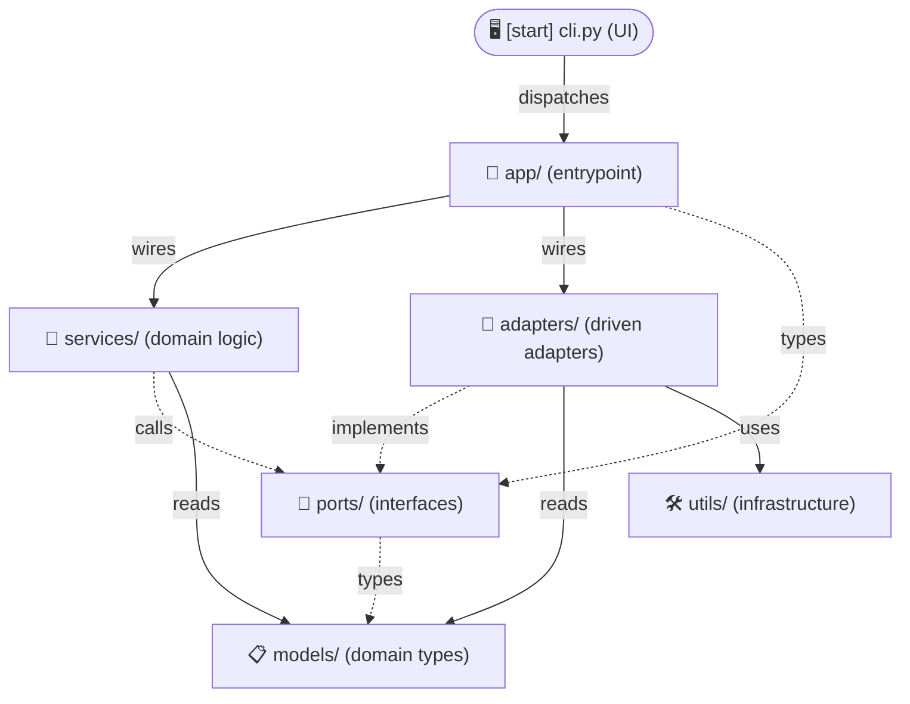
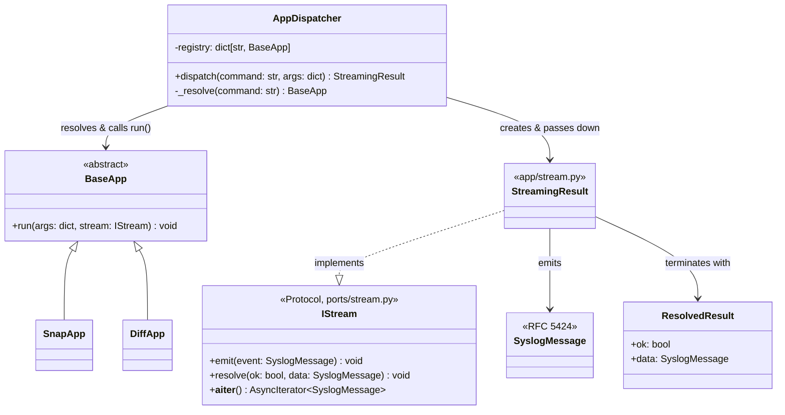
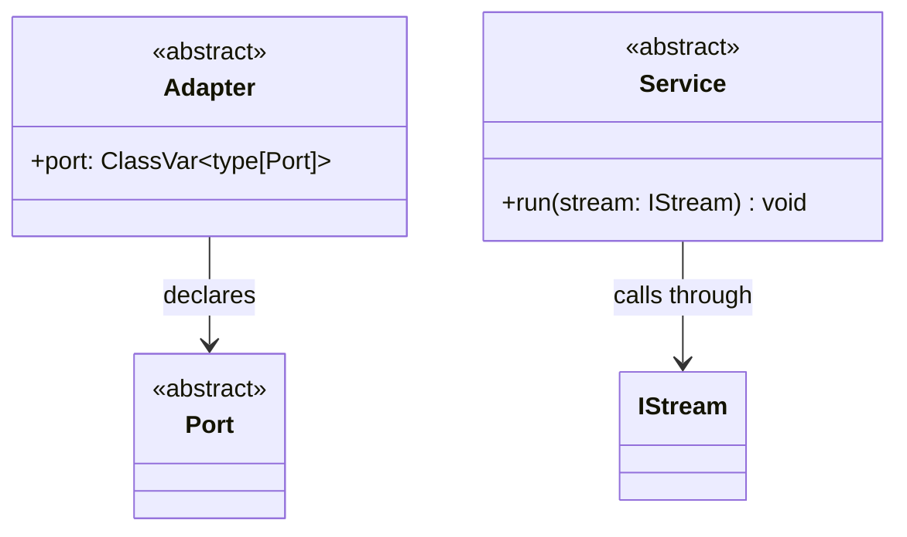

# Sempy Architecture

The goal is to focus on best-practice recommendations that genuinely reduce decision-making. The strongest moves are those that remove the most entropy per unit of added complexity.

> **Meta-rule:** every rule in this document must be machine-enforceable. Rules that cannot yet be enforced mechanically are marked *(deferred)* and excluded from the toolchain until a concrete gate can be defined.

## Standards

Sempy's I/O layer implements **SCOP (Structured CLI Output Protocol) v0.1.0-draft** — an open specification for structured CLI output that is simultaneously human-readable as plain text and automatically translatable to GUI. See `SCOP.md`.

| Sempy document | Implements |
| --- | --- |
| Wire Format (this doc) | SCOP §5 |
| Event vocabulary (`SCOP.md` §7) | SCOP §7 |

## Dependency Diagram

This is the import-dependency contract.



**Edge contract** — each verb names the only permitted coupling for that edge:

| Verb | Permits | Forbids | Enforced by |
| --- | --- | --- | --- |
| `dispatches` | import `AppDispatcher` only | reaching past it into `app/` | import-linter |
| `wires` | construct concrete classes | calling their methods directly | *(deferred)* |
| `implements` | subclass / realize a port | constructing or calling another adapter | ast-grep |
| `calls` | invoke port methods | constructing the implementation | import-linter |
| `reads` | import and read data types | mutating or adding behaviour | ruff + ty (frozen models) |
| `types` | reference for annotations only | runtime use | ruff TCH |
| `uses` | call pure functions | anything stateful | *(deferred)* |

Dotted arrows (`-.->`) cross an abstraction boundary; solid arrows cross a concrete one.

1. **cli.py** parses `argv` and calls into `app/`
2. **app/** wires the graph — injecting concrete adapters into services via ports
3. **services/** run domain logic, calling out through **ports/** interfaces
4. **adapters/** answer those port calls, using **models/** and **utils/** to do so
5. **adapters/** return a port interface back to the service
6. **services/** emit events and resolve the `StreamingResult`
7. **app/** returns the resolved `StreamingResult` to **cli.py** to render

> `cli.py` may only import `AppDispatcher`.
> `argparse` may only appear in `cli.py`.

## Toolchain

| Tool | Role | Config |
| --- | --- | --- |
| `import-linter` | Import layer contract | `.importlinter` |
| `ast-grep` | Structural + pattern rules | `sgconfig.yml`, `rules/*.yml` |
| `ruff` | Linting + formatting | `pyproject.toml` |
| `ty` | Type checking | `pyproject.toml` |

All four compose under a single `pre-commit` hook.

> **Consider also:** [Vulture](https://github.com/jendrikseipp/vulture) for dead code detection, [Lizard](https://github.com/terryyin/lizard) for cyclomatic complexity, and [jscpd](https://github.com/kucherenko/jscpd) for copy-paste detection — none are required but all complement the above toolchain on long-lived projects.

## Conventions

| # | Rule | Enforced by |
| --- | --- | --- |
| 1 | **Two-tier infrastructure** — `utils/` (mechanism) and `adapters/` (policy) may touch the outside world; `models/`, `ports/`, `services/`, and `app/` are stdlib-pure and side-effect-free | ast-grep |
| 2 | **Import layer contract** — dependency graph defines the only permitted import paths | import-linter |
| 3 | **One class per file, name = role** — `*_adapter.py` → `FooAdapter(Adapter)`, same for service/port/app | ast-grep |
| 4 | **Port↔adapter parity** — every adapter implements the port of the same filename | ast-grep |
| 5 | **Marker base per layer** — `Port`, `Adapter`, `Service`, `BaseApp` | ast-grep |
| 6 | **`models/` frozen, behavior-free** | ruff + ty |
| 7 | **`cli.py` may only import `AppDispatcher`** | import-linter |
| 8 | **`argparse` and `sys.exit` only in `cli.py`** | ast-grep |
| 9 | **MSGID from fixed table only** | ast-grep |
| 10 | **`utils/` subdirectory allowlist** | ast-grep |
| 11 | **Depth import rule** — a file may only import from deeper modules; never from a neighbour or anything closer to root. `app/dispatcher.py` resolves this by placing concrete apps one level deeper under `app/registry/` | ast-grep |

## AppDispatcher

`AppDispatcher` lives in `app/dispatcher.py`. Concrete apps live one level deeper under `app/registry/`, satisfying the depth import rule — `dispatcher.py` imports downward into `registry/`, never across siblings.

```text
app/
├── dispatcher.py
└── registry/
    ├── snap_app.py
    └── diff_app.py
```



## Marker Bases



| Base | Lives in | Enforcement hook |
| --- | --- | --- |
| `Port` | `ports/` | Every class in `ports/` must subclass `Port` |
| `Adapter` | `adapters/` | Must declare `port: ClassVar[type[Port]]` — enables parity check |
| `Service` | `services/` | Must implement `run(stream: IStream)` — stream is the result channel |

`Service.run()` returning `void` eliminates a separate result type — output flows through `IStream` events, not return values. `IStream` (`ports/stream.py`) is the interface services depend on; `StreamingResult` (`app/stream.py`) is the concrete implementation only `app/` and `cli.py` see.

## MSGIDs

Full specification: `SCOP.md` §7. The `PROCESS_*` family is the minimum viable set for any command that runs an operation.

| MSGID | Meaning | Required fields |
| --- | --- | --- |
| `PROCESS_BEGIN` | Start a named operation | `id`, `label` |
| `PROCESS_UPDATE` | Update progress | `id`, `current` |
| `PROCESS_END` | Complete an operation | `id`, `ok` |
| `PROCESS_LOG` | Freeform log line within an operation | `id`, `message` |

The `id` field ties events to a named operation. Nested or parallel operations use distinct `id` values — no new types required.

`ResolvedResult.data` must be a `PROCESS_END` message.

> `MSGID` must be one of the values defined in `SCOP.md` §7.

## Wire Format

Implements **SCOP §5**. `SyslogMessage` events are serialised as **NDJSON** — one JSON object per line. The schema is RFC 5424; the serialisation format is NDJSON.

```json
{"pri": 6, "msgid": "PROCESS_BEGIN", "room": "snapshot", "id": "snap", "label": "Snapshotting", "total": 142, "msg": "Snapshotting (142 files)"}
{"pri": 6, "msgid": "PROCESS_UPDATE", "room": "snapshot", "id": "snap", "current": 71, "total": 142, "msg": "71 of 142: docs/intro.md"}
{"pri": 6, "msgid": "PROCESS_END", "room": "snapshot", "id": "snap", "ok": true, "msg": "Snapshot complete"}
```

> `msg` must be a complete, human-readable line on its own — a plain `cat` of stdout must always be readable.
> `room` is derived from the subcommand path — never declared explicitly (SCOP §6).
> All other fields are RFC 5424 `STRUCTURED-DATA`.

## Utils

`utils/` is the **mechanism layer** — thin, stateless wrappers over the OS and stdlib with no domain meaning and no port implementations. Only `adapters/` may import from `utils/`.

Directories at the root of `utils/` can only be the following.

| Name | What it holds | Hard boundary |
| --- | --- | --- |
| `fs` | Read, write, copy, move, delete, mkdir, glob, stat | Single-file and directory ops only — not archives |
| `proc` | Spawn, capture stdout/stderr, pipe, timeout, kill | External processes only — not internal concurrency |
| `net` | HTTP requests, download, socket connect, DNS | Network I/O only — not serializing the payload |
| `fmt` | Encode/decode structured formats — JSON, TOML, YAML, CSV, base64 | Structured data only — not free-form string manipulation |
| `text` | Regex, templates, truncate, wrap, diff, split, normalize | Unstructured strings only — not structured formats |
| `env` | Env vars, platform/OS detection, Python interpreter path, cwd | Runtime context only — not logging or timing |
| `time` | Timestamps, durations, date formatting, monotonic clock | Temporal values only — not blocking waits (→ `concurrent`) or scheduling |
| `hash` | MD5/SHA checksums, content fingerprinting | Integrity primitives only — not keyed operations (HMAC → `crypto`) |
| `crypto` | Encrypt/decrypt, key derivation, HMAC, secure random tokens | Secrets only — not plain checksums |
| `archive` | Zip/tar/gzip pack and unpack | Compressed bundles only — not plain file copies |
| `concurrent` | Thread pool, async helpers, locks, queues, semaphores, sleep | Internal threads/tasks only — not external processes |
| `collect` | Merge dicts, chunk lists, group-by, flatten, deduplicate | In-memory data structure ops only — not I/O |
